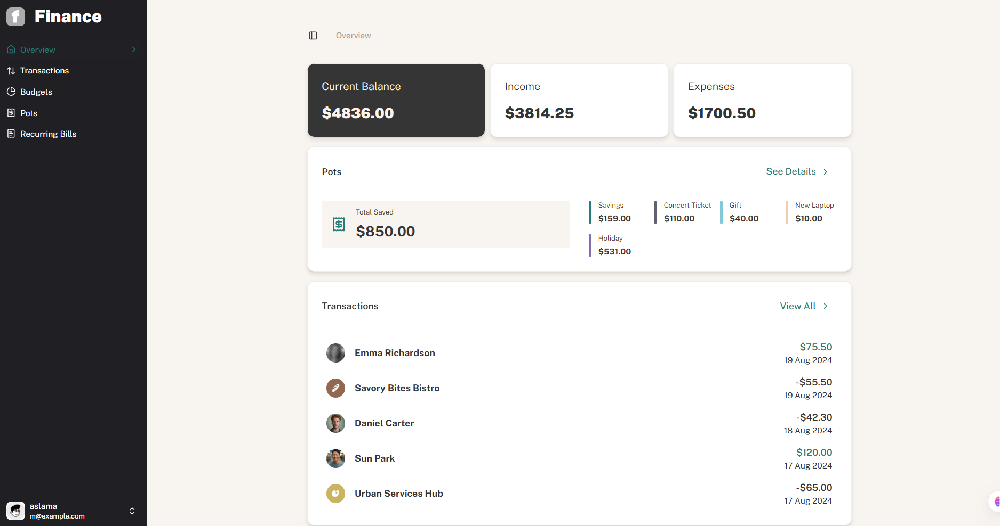
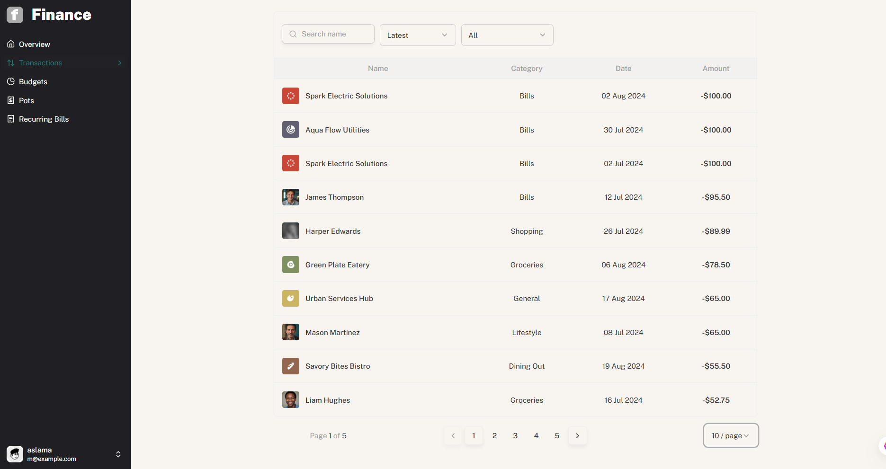
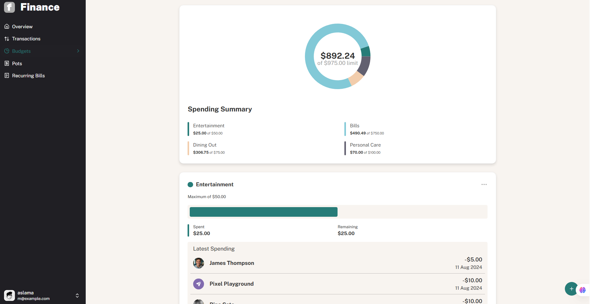

# Personal Finance App – Frontend Project

## Overview

This is a personal finance app frontend built using React, TypeScript, Tailwind CSS, and Vite.
The app allows users to view, manage, and track their personal finances in a clean and responsive interface.

Note: This is a frontend-only project. The data is loaded from a local data.json file. No backend or authentication is implemented.

## Features

Overview page displaying all personal finance data at-a-glance

Transactions page with pagination (10 transactions per page)

Search, sort, and filter transactions

CRUD operations for budgets and saving pots (using local state)

Display the latest three transactions per budget category

Track progress towards each saving pot

Manage recurring bills with status for the current month

Keyboard navigation for all interactive elements

Fully responsive design for mobile, tablet, and desktop

Interactive hover and focus states for UI elements

## Tech Stack

React.js – Component-based frontend

TypeScript – Strongly-typed and maintainable code

Tailwind CSS – Modern and responsive styling

Vite – Fast development and build tool

## Screenshots
 

🔗 **Live Demo:** [View App](https://lucky-otter-2fd70c.netlify.app/overview)
